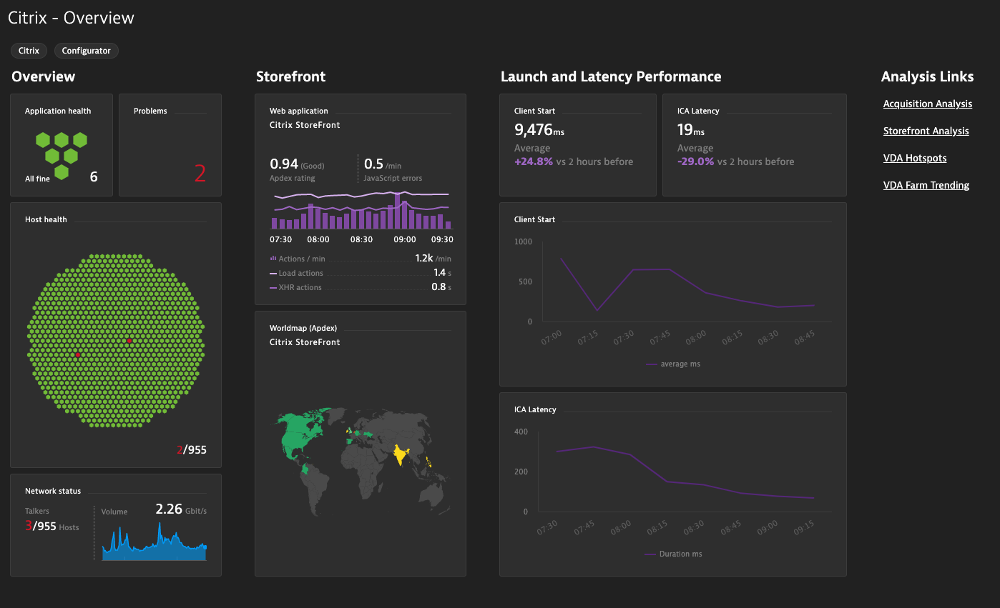

# Dynatrace Citrix Dashboards

These Dynatrace dashboards are pre-configured for monitoring your Citrix Environment. From VDA hotspots to StoreFront and end user analytics, the Dynatrace Citrix Dashboard Pack makes it easy to analyze your Citrix implementation and pinpoint areas for infrastructure and performance optimization. They are most effective when used with the [Dynatrace Citrix Extension](https://www.dynatrace.com/news/blog/optimize-citrix-platform-performance-and-user-experience-with-dynatrace/). For deployment, utilize the [BizOps Configurator](https://lucashocker.github.io/BizOpsConfigurator/). 

# Pre-Requisites and Best Practices
- Dynatrace deployed on your Citrix hosts. This includes VDAS, Delivery Controllers, and StoreFront Servers. 
- A [Management Zone](https://www.dynatrace.com/support/help/shortlink/management-zones-hub) defined in Dynatrace for your entire Citrix Environment. 
- An [Application Definition](https://www.dynatrace.com/support/help/shortlink/my-web-application) for the StoreFront app. 
- When multiple Citrix farms are utilized, it is recommended to utilize a [Host Group](https://www.dynatrace.com/support/help/shortlink/host-groups) and Management Zone for each Citrix VDA farm for easy filtering and analysis.
- The BizOps Configurator also takes the service name of your key StoreFront service to highlight it's performance in your Overview dashboard. This is the ASP.NET service typically named Default Web Site:443(/Citrix/Store) or StoreFront Web.
